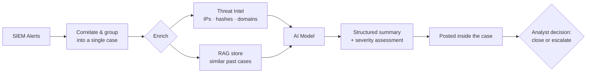
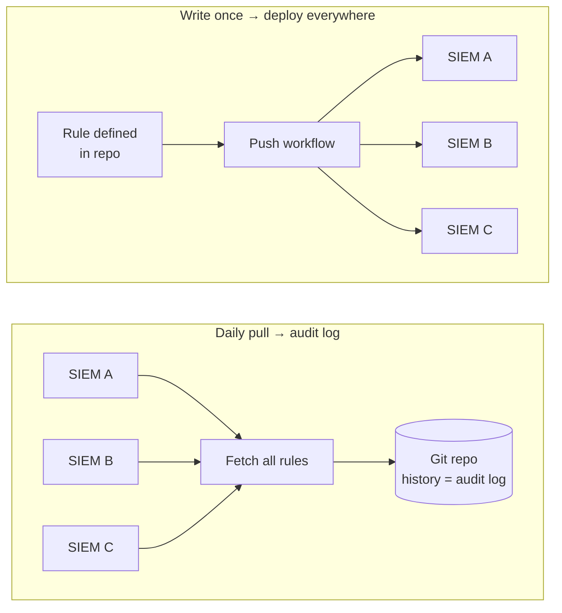
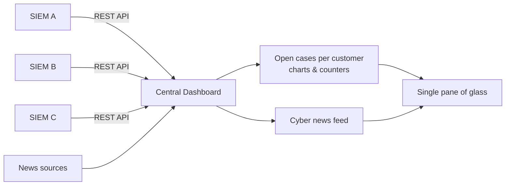

# Portfolio

A collection of projects and real-world use cases built to solve problems in
**Security Operations (SOC)**, **SIEM engineering**, and **AI-driven automation**.

This portfolio focuses on the *why* and the *what* — the problems faced in
day-to-day security operations, the solutions designed to address them, and the
impact they delivered. Each project below includes a short overview, the
challenge it tackled, and selected snippets/screenshots with sample data for
illustration.

> ℹ️ Screenshots and code snippets use **sample / anonymized data** only.

---

## At a Glance

| Project | What it does |
| --- | --- |
| [SOC AI Agent](#soc-ai-agent) | Auto-triages SIEM alerts — groups, enriches, and AI-summarizes cases so analysts just close or escalate |
| [Detection as Code](#detection-as-code) | Version-controls detection rules in Git and deploys them to all SIEMs from one push |
| [Central Dashboard](#central-dashboard) | Single pane of glass aggregating open cases across all customer SIEMs, plus a cyber news feed |
| [Log Parser](#log-parser) | Parses non-standard log sources into structured, queryable Elastic events |
| [SOC Report](#soc-report) | Generates a formatted Word SOC report from live SIEM metrics in under a minute |
| [Notifier](#notifier) | Backup notification path for high/critical cases via Email, Teams, and Telegram |
| [Session Manager](#session-manager) | Self-hosted, free RDP/SSH session manager replacing paid tooling |
| [CaseClock](#caseclock) | Estimates working time per case and reports it by customer and analyst |
| [Evaluations](#evaluations) | Purpose-built scripts that export ad-hoc user/endpoint activity to Excel |

---

## SOC AI Agent

**Problem**

SOC teams operating across multiple ELK SIEM instances were drowning in thousands of alerts every day. Analysts spent the bulk of their shifts on repetitive, manual work — reviewing raw alerts, grouping related events, opening cases, assigning them, and writing up assessments — with little time left for actual investigation or escalation decisions. Alert fatigue was real, morale was low, and high-severity threats risked being lost in the noise.

**Solution**

An AI-powered automation layer sits between the SIEM and the analyst. When alerts fire, the system automatically groups correlated alerts into a single case, then enriches it by checking all involved IOCs (IPs, hashes, domains) against threat intelligence feeds and querying a RAG (Retrieval-Augmented Generation) store of historical cases to surface similar past incidents. The enriched case context is then passed to an AI model which produces a structured case summary and a severity assessment. The result is posted directly inside the case — ready for the analyst to read.

**Impact**

Analysts no longer perform any of the triage legwork. Their entire workflow collapses to a single decision: **close or escalate**. Alert handling time dropped dramatically, analyst burnout was reduced, and consistency of triage improved since every case receives the same structured enrichment regardless of who is on shift.

**How it works**

<!--  -->

---

## Detection as Code

**Problem**

Each ELK SIEM had its own detection rule UI with no audit trail — no way to see who changed a rule, when, or why. Adding or modifying a rule meant logging into each SIEM individually and making the change by hand. With multiple SIEMs in the environment, keeping rules consistent across all of them was error-prone and time-consuming, and there was no history to review if a rule silently broke or got misconfigured.

**Solution**

A script runs daily to fetch all detection rules from every SIEM and commit them to a Git repository. The Git history becomes the audit log — every change, addition, and deletion is visible with a timestamp and diff. A separate push workflow allows writing a rule once and deploying it automatically to all SIEMs simultaneously. Adding, removing, or modifying a rule is now a code change in a repo rather than a manual UI operation on each instance.

**Impact**

Rule management went from a fragmented, untracked manual process to a fully auditable, version-controlled workflow. Deploying a new rule across all SIEMs dropped from a multi-step manual task per instance to a single push. Teams gained full visibility into rule history and the ability to review, roll back, or diff any change — something the native SIEM UIs never provided.

**How it works**

<!--  -->

---

## Central Dashboard

**Problem**

With multiple customer SIEMs to monitor, analysts had to keep a separate browser tab open for each SIEM UI and manually cycle through them every few minutes looking for open alerts. It was repetitive, easy to miss something, and meant context-switching constantly between unrelated UIs just to answer the question: "is anything open right now?"

**Solution**

A central web UI that pulls alert and case data from all SIEMs via their REST APIs and presents everything in one unified view. Charts and counters give an at-a-glance picture of open cases per customer — analysts only need to open a specific SIEM's UI when they actually see something to act on. A secondary tab aggregates the latest cybersecurity news from multiple sources, keeping the team informed without leaving the dashboard.

**Impact**

The tab-switching ritual was eliminated. Analysts now have a single pane of glass for all customers, reducing the chance of missing an open alert and cutting the time spent on passive monitoring. The news feed also keeps threat awareness integrated into the daily workflow rather than being a separate activity.

**How it works**

<!--  -->

---

## Log Parser

**Problem**

Not every log source ships with a native Elastic integration. Some sources send logs in custom or non-standard formats that Elastic cannot parse out of the box — meaning the raw data lands in the SIEM but fields aren't extracted, events aren't structured, and the logs are essentially invisible to detection rules and dashboards.

**Solution**

A parsing script sits between the log source and Elastic. It reads the raw log output, extracts the relevant fields, normalizes them, and ingests the structured data into Elastic in a queryable format. Each parser is tailored to the specific log source's format, turning unreadable raw text into properly indexed, searchable events.

**Impact**

Log sources that were previously dark — ingested but unusable — became fully visible in the SIEM. Detection rules, alerts, and dashboards could now cover these sources, closing coverage gaps that would otherwise go undetected.

<!--  -->

---

## SOC Report

**Problem**

Preparing a SOC report was a manual, time-consuming process — analysts had to log into each SIEM, collect metrics one by one (alert counts, case statistics, active rules, agent status, and more), then compile and format everything into a document. It was repetitive work that pulled skilled people away from actual security tasks.

**Solution**

A script that queries all relevant SIEM APIs, fetches and aggregates the metrics automatically — alerts, cases, detection rules, agent health, and more — then generates a fully formatted Microsoft Word report in under a minute. What used to take significant manual effort is now a single script run.

**Impact**

Report generation time dropped from hours of manual work to under one minute. Analysts are freed from the reporting grind, the data is consistent and accurate every time, and reports can be produced on demand rather than being a scheduled burden.

<!--  -->

---

## Notifier

**Problem**

High and critical severity cases need to reach the right people fast — especially outside business hours when an on-call analyst may not be actively watching the SIEM. If the primary notification system fails, there is no fallback, meaning a critical case could sit unacknowledged and breach SLA without anyone being aware.

**Solution**

A backup notification service that independently monitors for high and critical cases and delivers alerts via Email, Microsoft Teams, and Telegram. It operates as a safety net — if the primary notifier is down or misses an alert, this service ensures the notification still gets through. It can be used for SLA breach warnings, on-call paging, or both.

**Impact**

Eliminated the single point of failure in the alert notification chain. Critical cases now have a guaranteed delivery path regardless of the state of the primary notifier, ensuring on-call analysts are always reached and SLA obligations are protected.

<!--  -->

---

## Session Manager

**Problem**

Managing RDP and SSH sessions through jumphosts required paid third-party tools. The team was spending on licensing fees for software whose core function — storing host details and launching sessions — could be built in-house without the cost or vendor dependency.

**Solution**

A free, self-hosted session manager that stores host and jumphost configurations and allows analysts to initiate SSH and RDP sessions directly from the tool. No licensing, no external dependency — just a lightweight interface to organize and launch remote sessions.

**Impact**

Eliminated recurring licensing costs for commercial session management tools. The team gained a purpose-built replacement with no ongoing fees, full control over their host inventory, and the same core functionality they were paying for.

<!--  -->

---

## CaseClock

**Problem**

The case management system had no time tracking or time booking feature. There was no visibility into how much time was being spent on each case, making it impossible to report working hours accurately per customer or per analyst — a critical gap for billing, capacity planning, and performance reporting.

**Solution**

A script that processes cases from the case management system and estimates the working time spent on each one based on a configurable set of rules (case type, severity, actions taken, etc.). The results are compiled into an Excel report broken down by customer and by analyst, giving management a clear picture of where time is being spent without requiring manual time entry.

**Impact**

Restored visibility into case working time without changing the existing case management workflow or requiring analysts to manually log hours. Teams gained a per-customer, per-analyst time breakdown that supports billing accuracy, workload balancing, and operational reporting.

<!--  -->

---

## Evaluations

**Problem**

Management and customers regularly request ad-hoc evaluations — alert or case counts over a period, a specific user's activity log, an endpoint's behavior on a given day. Each request meant manually querying the SIEM, assembling the data, and formatting it into something readable. With requests coming in frequently and covering different topics, it was a recurring time drain.

**Solution**

A collection of purpose-built scripts, one per evaluation type. For user and endpoint evaluations, each script collects a defined set of activity categories — network connections, process executions, and more — for the requested subject and time window, then exports everything into a structured Excel report. New evaluation types can be added as new scripts without touching existing ones.

**Impact**

Ad-hoc evaluation requests that previously required manual SIEM querying and formatting are now fulfilled by running the relevant script. Response time to management and customer requests dropped significantly, and the output is consistent and professional every time.

<!--  -->
