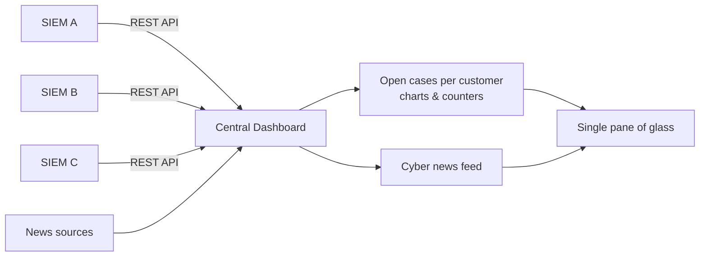

# Central Dashboard

**Problem**

With multiple customer SIEMs to monitor, analysts had to keep a separate browser tab open for each SIEM UI and manually cycle through them every few minutes looking for open alerts. It was repetitive, easy to miss something, and meant context-switching constantly between unrelated UIs just to answer the question: "is anything open right now?"

**Solution**

A central web UI that pulls alert and case data from all SIEMs via their REST APIs and presents everything in one unified view. Charts and counters give an at-a-glance picture of open cases per customer — analysts only need to open a specific SIEM's UI when they actually see something to act on. A secondary tab aggregates the latest cybersecurity news from multiple sources, keeping the team informed without leaving the dashboard.

**Impact**

The tab-switching ritual was eliminated. Analysts now have a single pane of glass for all customers, reducing the chance of missing an open alert and cutting the time spent on passive monitoring. The news feed also keeps threat awareness integrated into the daily workflow rather than being a separate activity.

**How it works**

<!--  -->
