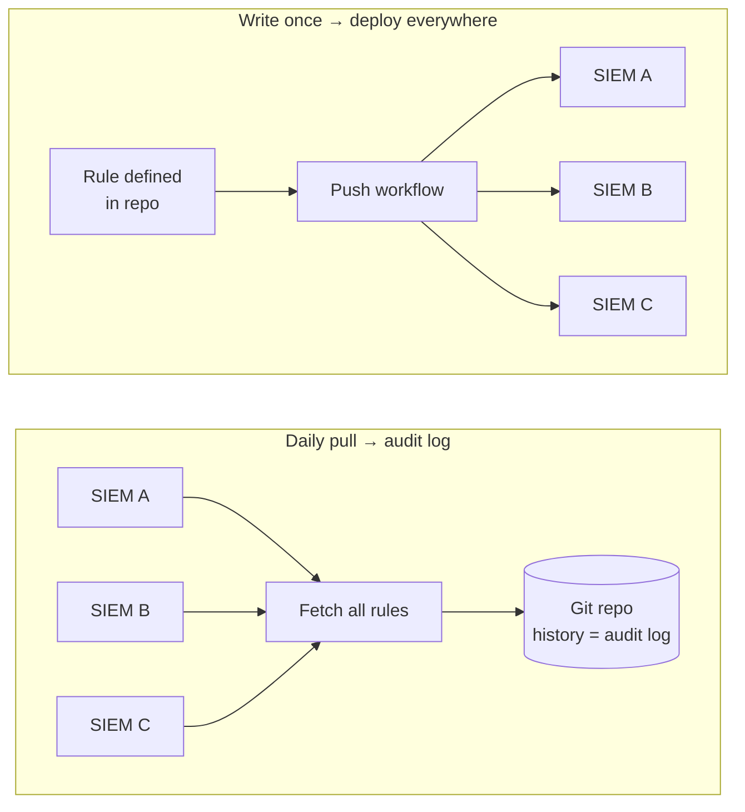

# Detection as Code

**Problem**

Each ELK SIEM had its own detection rule UI with no audit trail — no way to see who changed a rule, when, or why. Adding or modifying a rule meant logging into each SIEM individually and making the change by hand. With multiple SIEMs in the environment, keeping rules consistent across all of them was error-prone and time-consuming, and there was no history to review if a rule silently broke or got misconfigured.

**Solution**

A script runs daily to fetch all detection rules from every SIEM and commit them to a Git repository. The Git history becomes the audit log — every change, addition, and deletion is visible with a timestamp and diff. A separate push workflow allows writing a rule once and deploying it automatically to all SIEMs simultaneously. Adding, removing, or modifying a rule is now a code change in a repo rather than a manual UI operation on each instance.

**Impact**

Rule management went from a fragmented, untracked manual process to a fully auditable, version-controlled workflow. Deploying a new rule across all SIEMs dropped from a multi-step manual task per instance to a single push. Teams gained full visibility into rule history and the ability to review, roll back, or diff any change — something the native SIEM UIs never provided.

**How it works**

<!--  -->
