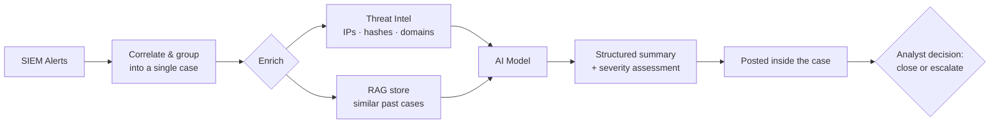

# SOC AI Agent

**Problem**

SOC teams operating across multiple ELK SIEM instances were drowning in thousands of alerts every day. Analysts spent the bulk of their shifts on repetitive, manual work — reviewing raw alerts, grouping related events, opening cases, assigning them, and writing up assessments — with little time left for actual investigation or escalation decisions. Alert fatigue was real, morale was low, and high-severity threats risked being lost in the noise.

**Solution**

An AI-powered automation layer sits between the SIEM and the analyst. When alerts fire, the system automatically groups correlated alerts into a single case, then enriches it by checking all involved IOCs (IPs, hashes, domains) against threat intelligence feeds and querying a RAG (Retrieval-Augmented Generation) store of historical cases to surface similar past incidents. The enriched case context is then passed to an AI model which produces a structured case summary and a severity assessment. The result is posted directly inside the case — ready for the analyst to read.

**Impact**

Analysts no longer perform any of the triage legwork. Their entire workflow collapses to a single decision: **close or escalate**. Alert handling time dropped dramatically, analyst burnout was reduced, and consistency of triage improved since every case receives the same structured enrichment regardless of who is on shift.

**How it works**

<!--  -->
